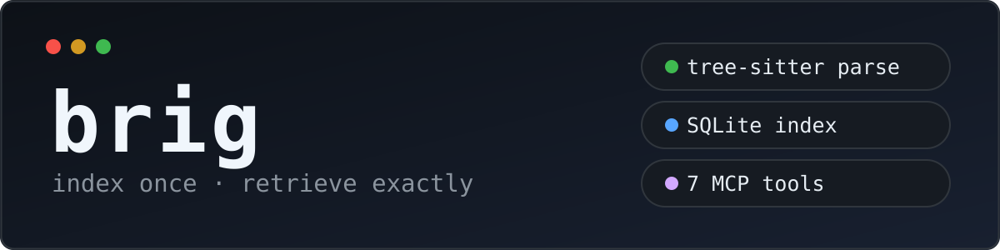
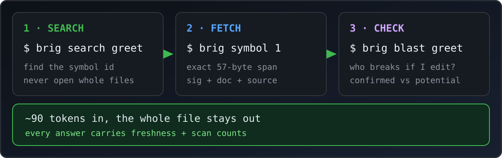
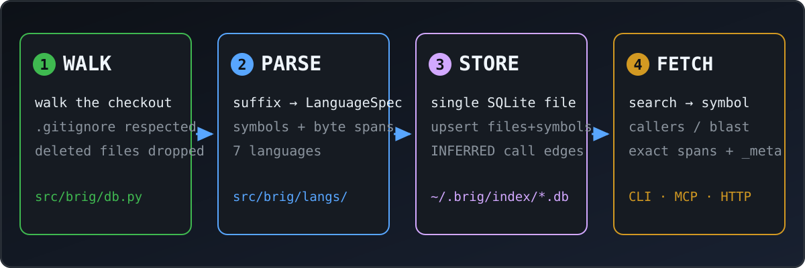
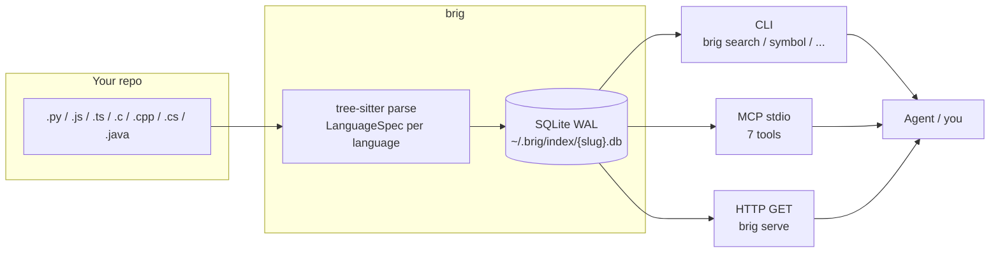
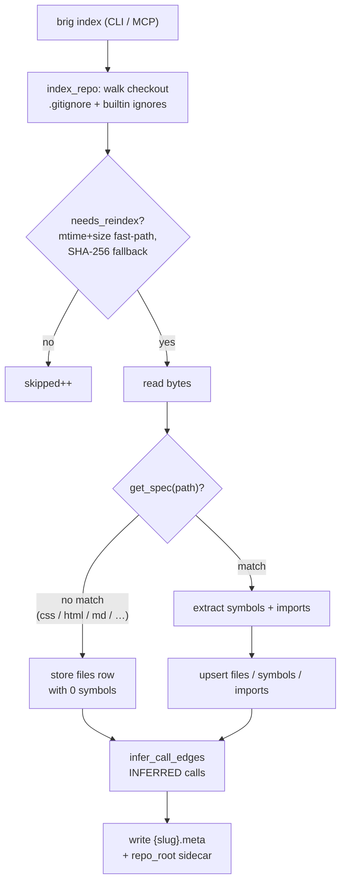
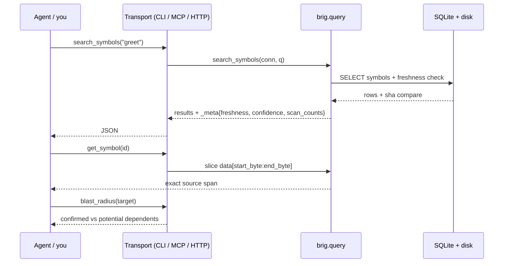
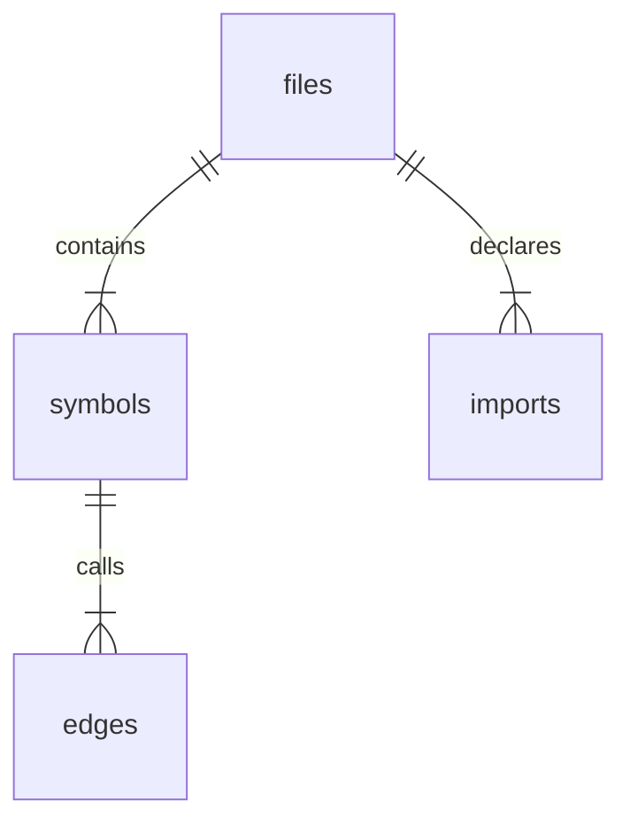

# brig



Deterministic code-graph index for one repo. tree-sitter parses your code into symbols in a single SQLite file — queryable through a CLI, 7 MCP tools, and a read-only HTTP API.

Agents waste tokens reading whole files. Index once, retrieve exact spans: symbol search, outlines, refs, caller/callee walks. Every response carries freshness and scan counts in a `_meta` envelope instead of guessed negatives. No embeddings, no graph DB, no telemetry.

- **Status:** v0.1.0 · Python >= 3.11 · `uv run pytest` green on `main` · MIT
- **Store:** one SQLite WAL file per repo at `~/.brig/index/{slug}.db` (+ `.meta` sidecar)

## Contents

- [The 30-second version](#the-30-second-version)
- [How it works](#how-it-works)
- [Features](#features)
- [Supported languages](#supported-languages)
- [Quickstart](#quickstart)
- [CLI reference](#cli-reference)
- [MCP setup](#mcp-setup)
- [HTTP API](#http-api)
- [Configuration & freshness](#configuration--freshness)
- [Architecture](#architecture)
- [Token savings](#token-savings)
- [Docker](#docker)
- [Troubleshooting](#troubleshooting)
- [Development](#development)
- [Roadmap & non-goals](#roadmap--non-goals)
- [Links](#links)

## The 30-second version



Your codebase is too big to paste into a prompt. So don't:

1. **Index it once** — `brig index . --slug myrepo` parses every supported file into symbols (name, signature, byte offsets) in one SQLite file.
2. **Search, don't read** — `brig search greet` finds the symbol and its id. No guessing, no whole-file reads.
3. **Fetch the exact slice** — `brig symbol 1` returns just that function (~90 tokens, not the whole file). `brig blast greet` tells you what breaks if you edit it.

That's the whole idea. Everything below is detail. Start at [Quickstart](#quickstart).

## How it works





Four stages, no magic:

1. **Walk** — `index_repo` walks the checkout, respects `.gitignore` plus built-in ignores (`.git`, `.venv`, `node_modules`, `__pycache__`), and drops deleted files (`src/brig/db.py`).
2. **Parse** — each file is dispatched by suffix to a `LanguageSpec` (`src/brig/langs/` + `src/brig/parse.py`). A spec returns symbols (`qualname`, `kind`, `sig`, `doc`, `start_byte`, `end_byte`) plus raw import specs. Tree-sitter byte offsets are authoritative — spans are sliced from disk, never guessed.
3. **Store** — upserts into `files` / `symbols` / `imports`, then `infer_call_edges` derives `calls` edges (`INFERRED`) so `callers` / `callees` / `blast` work. The `.meta` sidecar records `repo_root` so later queries resolve freshness.
4. **Retrieve** — `search` → `get_symbol` for exact spans → `callers` / `blast` before edits → `check_refs` before deletes. Absent results still return `scan_counts`, so "not found" is evidence, not a guess.

Indexing flow in detail:

<details>
<summary>Indexing flowchart (click to expand)</summary>



</details>

Typical agent loop:

<details>
<summary>Agent loop sequence (click to expand)</summary>



</details>

## Features

- **Index once, retrieve exactly** — tree-sitter AST → symbols with byte offsets → exact source slices, not whole files.
- **Graph without a graph DB** — import/call edges derived from symbols on read, tagged `EXTRACTED` vs `INFERRED`.
- **7 MCP tools, hard cap** — `index`, `search_symbols`, `get_symbol`, `get_outline`, `callers_callees`, `blast_radius`, `check_refs`.
- **CLI mirror** — every tool as `brig <subcommand>` with JSON output.
- **Read-only HTTP API** — same queries over `GET` as JSON (`brig serve`, loopback by default).
- **Incremental** — mtime+size fast-path with SHA-256 fallback; only changed files re-index, deleted files are removed.
- **Honest negatives** — absence claims always carry `scan_counts`.

## Supported languages

| Language | Extensions | Symbols | Imports |
| --- | --- | --- | --- |
| Python | `.py` | functions, classes, methods + docstrings | `import` / `from` |
| JavaScript | `.js` `.jsx` `.mjs` `.cjs` | functions, classes, methods + leading comments | `import` / `require` / dynamic `import()` |
| TypeScript | `.ts` `.tsx` `.mts` `.cts` | same as JS (TSX fallback) | same as JS |
| C | `.c` `.h` | functions, structs/enums (as classes) | `#include` |
| C++ | `.cpp` `.hpp` `.cc` `.cxx` `.hh` `.h++` | functions, classes, methods, ctors, templates, namespaces | `#include` |
| C# | `.cs` | classes, interfaces, methods, ctors, namespaces | `using` |
| Java | `.java` | classes, methods, ctors (package-qualified) | `package` + `import` |

Notes:

- `.h` is owned by **C** (C++ uses `.hpp` / `.hh`, never `.h`).
- Symbol kinds are `function` | `class` | `method` — constructors, structs, enums, and interfaces map into these.
- Sigs cap at 200 chars, docs at 500.
- Files with no matching spec (CSS, HTML, Markdown, …) are currently recorded as `files` rows with **0 symbols** — they still count in `files_scanned`. Skipping them with a reported count is on the [roadmap](#roadmap--non-goals).

## Quickstart

Requires Python >= 3.11 and [`uv`](https://docs.astral.sh/uv/).

```sh
uv sync
uv run pytest      # must be green
uv run brig --help # CLI smoke test

uv run brig index . --slug myrepo
uv run brig search my_function --slug myrepo
uv run brig outline src/app.py --slug myrepo
```

When a single repo is indexed, `--slug` can be omitted. Example response shape (trimmed, real output):

```json
{
  "results": [
    {
      "id": 1, "path": "app.py", "qualname": "greet",
      "kind": "function", "sig": "def greet(name):", "doc": "Greet.",
      "start_byte": 0, "end_byte": 57, "score": 1000
    }
  ],
  "_meta": {
    "freshness": "fresh", "confidence": 1.0,
    "scan_counts": {"files_scanned": 1, "symbols_scanned": 1}
  }
}
```

`get_symbol` returns the same symbol row plus `"source"` — the byte-exact slice `data[start_byte:end_byte]` — and `"error": null`.

## CLI reference

```sh
brig index <path> [--slug <name>] [--root <store>]
brig search <query> [--slug] [--repo] [--root]
brig outline [path] [--slug] [--repo] [--root]
brig symbol <id> [--slug] [--repo] [--root]
brig refs <identifier> [--slug] [--repo] [--root]
brig callers <qualname> [--depth 1-3] [--slug] [--repo] [--root]
brig callees <qualname> [--depth 1-3] [--slug] [--repo] [--root]
brig blast <qualname|path> [--slug] [--repo] [--root]
brig list [--root]
brig serve [--host 127.0.0.1] [--port 8000] [--root <store>]
```

- `--slug` picks the repo when several are indexed (`brig list` shows them).
- `--repo` overrides the checkout path (defaults to the path recorded at index time).
- `--root` moves the store (defaults to `~/.brig`).
- `--depth` caps caller/callee walks at 3.
- Output is JSON on stdout (forward-slash paths, `_meta` included); errors go to stderr with exit code 1.

## MCP setup

`brig` serves its 7 tools over stdio (JSON-RPC 2.0, stdlib only — `src/brig/mcp.py`). A wiring snippet lives at `configs/mcp.json`; replace the `"."` placeholder with the **absolute** path of this checkout, then restart your client.

Generic snippet:

```json
{"mcpServers": {"brig": {"command": "uv", "args": ["run", "--directory", "/abs/path/to/brig", "python", "-m", "brig.mcp"]}}}
```

Codex (`~/.codex/config.toml`):

```toml
[mcp_servers.brig]
command = "uv"
args = ["run", "--directory", "/abs/path/to/brig", "python", "-m", "brig.mcp"]
```

Claude Code (`.mcp.json` in your project or global config): use the generic snippet above.

Typical agent flow: `index` (or `brig index` beforehand) → `search_symbols` → `get_symbol` for exact spans → `callers_callees` / `blast_radius` before edits → `check_refs` before deletes. Details: `configs/README.md`.

## HTTP API

Read-only. Same queries, no new tools. Binds loopback unless `--host` is set.

```sh
brig serve --port 8000
curl "http://127.0.0.1:8000/api/v1/search?slug=myrepo&q=norm_path"
```

| Endpoint | Query params |
| --- | --- |
| `/api/v1/live` | — returns `{"status": "ok"}` |
| `/api/v1/slugs` | — lists indexed slugs |
| `/api/v1/search` | `slug`, `q` |
| `/api/v1/outline` | `slug`, optional `path` |
| `/api/v1/symbol` | `slug`, `id` (positive integer) |
| `/api/v1/refs` | `slug`, `ident` |
| `/api/v1/callers` | `slug`, `qualname`, optional `depth` (1–3) |
| `/api/v1/callees` | `slug`, `qualname`, optional `depth` (1–3) |
| `/api/v1/blast` | `slug`, `target` |

Errors are `{"error": msg}` with 400 (missing/bad param) or 404 (unknown slug/endpoint). `/` serves a tiny human landing page. Routes: `src/brig/serve.py`. Each request opens its own SQLite connection (WAL reads are concurrency-safe) and returns the `brig.query` dict verbatim, `_meta` included.

## Configuration & freshness

Store layout per repo slug:

```text
~/.brig/index/{slug}.db    SQLite WAL (files, symbols, imports, edges)
~/.brig/index/{slug}.meta  sidecar: schema_version, file_count, last_indexed, repo_root
```

Every response carries `_meta`:

| Freshness | Meaning | Confidence |
| --- | --- | --- |
| `fresh` | stored SHA matches bytes on disk | `1.0` |
| `edited_uncommitted` | SHA differs, disk mtime is newer | `0.5` |
| `stale_index` | missing from disk or index | `0.0` |

`scan_counts` (`files_scanned`, `symbols_scanned`, plus `edges_scanned` on graph queries) accompanies results so negatives are verifiable. Search ranking is a deterministic substring rank — exact `qualname` first, then `qualname` substring, then `sig`/`doc` substring, ties broken by symbol degree — stdlib only, no BM25 dependency.

## Architecture

```text
src/brig/db.py      SQLite WAL storage + incremental index pipeline
src/brig/parse.py   tree-sitter pipeline (Symbol, ExtractResult, suffix dispatch)
src/brig/langs/     LanguageSpec registry (c/cpp/csharp/java/python/js/ts)
src/brig/query.py   search/outline/refs/callers/blast + _meta envelope
src/brig/cli.py     argparse CLI mirror (JSON out, stderr + exit 1 on error)
src/brig/mcp.py     stdio MCP server (7 tools, hard cap)
src/brig/serve.py   read-only HTTP API (GET → brig.query, verbatim JSON)
tests/fixtures/     tiny synthetic repos for tests
configs/mcp.json    MCP client wiring snippet
deploy/             Dockerfile + compose for gateway hosting
skills/             investigator/builder/reviewer agent skills
plans/              per-task plans (see plans/README.md)
```

Data model (one SQLite file per repo):



```text
files(path, sha256, mtime, size)
symbols(path, qualname, kind, sig, doc, start_byte, end_byte)
imports(src_path, dst_spec)
edges(src_id, dst_id, kind, confidence)   -- confidence: EXTRACTED | INFERRED
```

New languages are additive: one `LanguageSpec` (`matches` + `extract`) in `src/brig/langs/` plus a registry entry in `src/brig/langs/__init__.py` — no core changes. Design: `SPEC.md`. Agent profile: `AGENTS.md`.

## Token savings

- **Measured** on this repo (`brig` itself): the full outline is ~9k tokens vs ~33k to read all Python sources (**~72% saved**); a `search` + `get_symbol` round-trip returns a ~90-token exact slice instead of a whole file.
- **Estimated** for larger repos: per-fix savings typically land at 90%+ vs naive whole-file reads — scales with repo size and how many files the agent would otherwise open.

## Docker

```sh
mkdir -p deploy/repos  # checkouts to index, mounted read-only
docker compose -f deploy/docker-compose.yml up -d --build
docker compose -f deploy/docker-compose.yml exec brig brig index /repos/<name> --slug <name>
curl "http://localhost/brig/api/v1/search?slug=<name>&q=<query>"
```

The image serves `brig serve --host 0.0.0.0 --port 8000` (`Dockerfile`); index data lives in the `brig-index` volume, repos mount at `/repos:ro`, healthcheck hits `/api/v1/live`. The compose file targets a Traefik homelab gateway (`PathPrefix(`/brig`)`) — adjust networks/labels if you don't use one.

## Troubleshooting

- `unknown slug 'x'; see brig list` — index it first (`brig index <path> --slug x`) or pass the right `--slug`.
- `multiple indexed repos [...]; require --slug` — more than one `.db` exists and no `--slug` was given; add `--slug` (single-repo stores resolve automatically).
- `freshness: edited_uncommitted` — the file changed on disk after indexing; re-run `brig index` (incremental — only changed files re-parse).
- `freshness: stale_index` / `error: not_found` — the symbol or file isn't in the index; check the path, re-index, and read `scan_counts` before concluding anything is absent.
- Empty outline for CSS/HTML/Markdown — expected today: those suffixes have no `LanguageSpec` and index as 0-symbol `files` rows (see language notes).
- `brig serve` unreachable — it binds `127.0.0.1` by default; keep it that way locally and only set `--host` behind a trusted proxy.

## Development

```sh
uv sync
uv run pytest            # full suite, must be green every change
uv run pytest tests/test_langs_java.py   # narrower run
uv run brig index .      # smoke test on brig itself
```

Conventions: TDD (failing test first), conventional commits (`feat:` `fix:` `test:` `docs:` `refactor:`), 1–2 files per change with `path:line-range — change` receipts. `uv.lock` is committed. Index files (`*.db`) and `.local/` are gitignored — never commit them.

## Roadmap & non-goals

Planned (see `plans/`): skip unsupported files with a reported `skipped_unsupported` count, `start_line` / `end_line` / `est_tokens` derived at read time (no migration), a minimal single-file `serve` explorer, and `index --watch` polling on the existing `needs_reindex` fast-path.

Bloat firewall (`SPEC.md`): no embeddings/vector store, no graph DBs, no per-IDE installers, no telemetry — anything needing a backend beyond `tree-sitter` + stdlib `sqlite3` waits for v2.

## Links

- Spec: `SPEC.md` · Agents: `AGENTS.md` · Implementation plan: `PLAN.md`
- Swarm kit: `skills/`, `plans/` (template: `plans/README.md`)
- MCP wiring: `configs/mcp.json`, `configs/README.md`
- Service definition: `deploy/docker-compose.yml`

MIT — see `LICENSE`.
